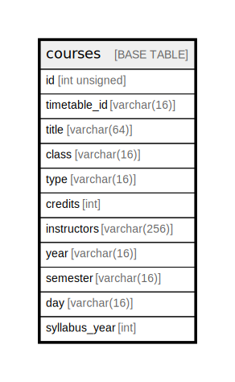

# courses

## Description

<details>
<summary><strong>Table Definition</strong></summary>

```sql
CREATE TABLE `courses` (
  `id` int unsigned NOT NULL AUTO_INCREMENT,
  `timetable_id` varchar(16) COLLATE utf8mb4_unicode_ci NOT NULL,
  `title` varchar(64) COLLATE utf8mb4_unicode_ci NOT NULL,
  `class` varchar(16) COLLATE utf8mb4_unicode_ci NOT NULL,
  `type` varchar(16) COLLATE utf8mb4_unicode_ci NOT NULL,
  `credits` int NOT NULL,
  `instructors` varchar(256) COLLATE utf8mb4_unicode_ci NOT NULL,
  `year` varchar(16) COLLATE utf8mb4_unicode_ci NOT NULL,
  `semester` varchar(16) COLLATE utf8mb4_unicode_ci NOT NULL,
  `day` varchar(16) COLLATE utf8mb4_unicode_ci NOT NULL,
  `syllabus_year` int NOT NULL,
  PRIMARY KEY (`id`),
  UNIQUE KEY `courses_idx` (`timetable_id`,`title`,`class`,`year`,`semester`,`day`,`syllabus_year`)
) ENGINE=InnoDB DEFAULT CHARSET=utf8mb4 COLLATE=utf8mb4_unicode_ci
```

</details>

## Columns

| Name | Type | Default | Nullable | Extra Definition | Children | Parents | Comment |
| ---- | ---- | ------- | -------- | ---------------- | -------- | ------- | ------- |
| id | int unsigned |  | false | auto_increment |  |  |  |
| timetable_id | varchar(16) |  | false |  |  |  |  |
| title | varchar(64) |  | false |  |  |  |  |
| class | varchar(16) |  | false |  |  |  |  |
| type | varchar(16) |  | false |  |  |  |  |
| credits | int |  | false |  |  |  |  |
| instructors | varchar(256) |  | false |  |  |  |  |
| year | varchar(16) |  | false |  |  |  |  |
| semester | varchar(16) |  | false |  |  |  |  |
| day | varchar(16) |  | false |  |  |  |  |
| syllabus_year | int |  | false |  |  |  |  |

## Constraints

| Name | Type | Definition |
| ---- | ---- | ---------- |
| courses_idx | UNIQUE | UNIQUE KEY courses_idx (timetable_id, title, class, year, semester, day, syllabus_year) |
| PRIMARY | PRIMARY KEY | PRIMARY KEY (id) |

## Indexes

| Name | Definition |
| ---- | ---------- |
| PRIMARY | PRIMARY KEY (id) USING BTREE |
| courses_idx | UNIQUE KEY courses_idx (timetable_id, title, class, year, semester, day, syllabus_year) USING BTREE |

## Relations



---

> Generated by [tbls](https://github.com/k1LoW/tbls)
