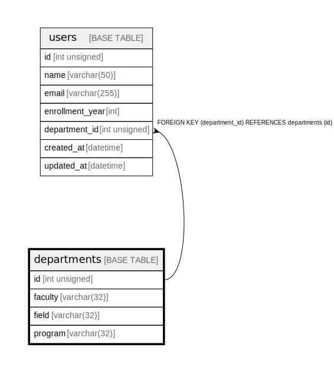

# departments

## Description

<details>
<summary><strong>Table Definition</strong></summary>

```sql
CREATE TABLE `departments` (
  `id` int unsigned NOT NULL AUTO_INCREMENT,
  `faculty` varchar(32) COLLATE utf8mb4_unicode_ci NOT NULL,
  `field` varchar(32) COLLATE utf8mb4_unicode_ci NOT NULL,
  `program` varchar(32) COLLATE utf8mb4_unicode_ci NOT NULL,
  PRIMARY KEY (`id`),
  UNIQUE KEY `departments_idx` (`faculty`,`field`,`program`)
) ENGINE=InnoDB DEFAULT CHARSET=utf8mb4 COLLATE=utf8mb4_unicode_ci
```

</details>

## Columns

| Name | Type | Default | Nullable | Extra Definition | Children | Parents | Comment |
| ---- | ---- | ------- | -------- | ---------------- | -------- | ------- | ------- |
| id | int unsigned |  | false | auto_increment | [users](users.md) |  |  |
| faculty | varchar(32) |  | false |  |  |  |  |
| field | varchar(32) |  | false |  |  |  |  |
| program | varchar(32) |  | false |  |  |  |  |

## Constraints

| Name | Type | Definition |
| ---- | ---- | ---------- |
| departments_idx | UNIQUE | UNIQUE KEY departments_idx (faculty, field, program) |
| PRIMARY | PRIMARY KEY | PRIMARY KEY (id) |

## Indexes

| Name | Definition |
| ---- | ---------- |
| PRIMARY | PRIMARY KEY (id) USING BTREE |
| departments_idx | UNIQUE KEY departments_idx (faculty, field, program) USING BTREE |

## Relations



---

> Generated by [tbls](https://github.com/k1LoW/tbls)
