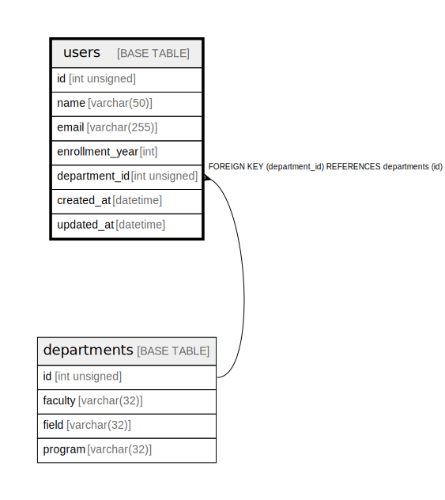

# users

## Description

<details>
<summary><strong>Table Definition</strong></summary>

```sql
CREATE TABLE `users` (
  `id` int unsigned NOT NULL AUTO_INCREMENT,
  `name` varchar(50) COLLATE utf8mb4_unicode_ci NOT NULL,
  `email` varchar(255) COLLATE utf8mb4_unicode_ci NOT NULL,
  `enrollment_year` int NOT NULL,
  `department_id` int unsigned NOT NULL,
  `created_at` datetime NOT NULL DEFAULT CURRENT_TIMESTAMP,
  `updated_at` datetime NOT NULL DEFAULT CURRENT_TIMESTAMP,
  PRIMARY KEY (`id`),
  UNIQUE KEY `users_idx` (`email`),
  KEY `department_id` (`department_id`),
  CONSTRAINT `users_ibfk_1` FOREIGN KEY (`department_id`) REFERENCES `departments` (`id`) ON DELETE RESTRICT
) ENGINE=InnoDB DEFAULT CHARSET=utf8mb4 COLLATE=utf8mb4_unicode_ci
```

</details>

## Columns

| Name | Type | Default | Nullable | Extra Definition | Children | Parents | Comment |
| ---- | ---- | ------- | -------- | ---------------- | -------- | ------- | ------- |
| id | int unsigned |  | false | auto_increment |  |  |  |
| name | varchar(50) |  | false |  |  |  |  |
| email | varchar(255) |  | false |  |  |  |  |
| enrollment_year | int |  | false |  |  |  |  |
| department_id | int unsigned |  | false |  |  | [departments](departments.md) |  |
| created_at | datetime | CURRENT_TIMESTAMP | false | DEFAULT_GENERATED |  |  |  |
| updated_at | datetime | CURRENT_TIMESTAMP | false | DEFAULT_GENERATED |  |  |  |

## Constraints

| Name | Type | Definition |
| ---- | ---- | ---------- |
| PRIMARY | PRIMARY KEY | PRIMARY KEY (id) |
| users_ibfk_1 | FOREIGN KEY | FOREIGN KEY (department_id) REFERENCES departments (id) |
| users_idx | UNIQUE | UNIQUE KEY users_idx (email) |

## Indexes

| Name | Definition |
| ---- | ---------- |
| department_id | KEY department_id (department_id) USING BTREE |
| PRIMARY | PRIMARY KEY (id) USING BTREE |
| users_idx | UNIQUE KEY users_idx (email) USING BTREE |

## Relations



---

> Generated by [tbls](https://github.com/k1LoW/tbls)
